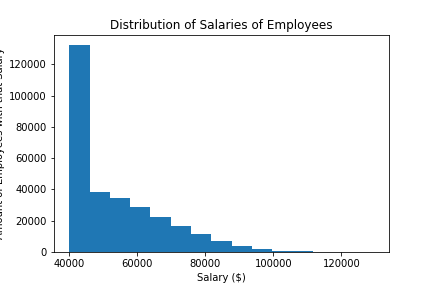

### Problem this analysis is trying to solve:
As a new data engineer for a company, my first major task is a research project on employees of the corporation from the 1980s and 1990s. All that remain of the database of employees from that period are six CSV files. These are the questions I need to solve by running queries on PostgreSQL:
1. List the employee number, last name, first name, sex, and salary for all employees.
1. List first name, last name, and hire date for employees who were hired in 1986.
1. List the managers of each department with the following information: department number, department name, the manager's employee number, last name, first name.
1. List the department of each employee with the following information: employee number, last name, first name, and department name.
1. List first name, last name, and sex for employees whose first name is "Hercules" and last names begin with "B."
1. List all employees in the Sales department, including their employee number, last name, first name, and department name.
1. List all employees in the Sales and Development departments, including their employee number, last name, first name, and department name.
1. In descending order, list the frequency count of employee last names, i.e., how many employees share each last name.
Then, by importing the database into Pandas, I need to:
1. Create a histogram to visualize the most common salary ranges for employees.
1. Create a bar chart of average salaries of employees by title.

### How to run the code:
1. Download and save all the files of the repository in the "EmployeeSQL" folder (except the "figures" folder) to a folder on your computer.
1. Open up PostgreSQL.
1. Create a new database called "employees_db".
1. Open up the query editor for the database you just created.
1. Copy and paste the code from the "emplyees_db_schema.sql" file. Run the code to create the tables for the database.
1. For each table, import the corresponding csv file in this order: titles, employees, salaries, departments, dept_emp, dept_manager
1. Clear out the query edior.
1. Cope and paste the code from the "employees_db_queries.sql" file. Run each query one at a time to view each report.
1. Open your terminal.
1. cd into the folder you saved the files in.
1. Run the command "jupyter notebook". This will open the folder in the Jupyter Notebook website.
1. Open up the "employees_db_graphs.ipynb" file on Jupyter Notebook.
1. At the top, under the "Kernal" tab, click "Restart & Run All". This will run all the cells on the page and display all the dataframes graphs.

### Data Collected:

### Why the data is displayed this way:
The queries are displayed in tables because they are reports run by PostgreSQL.
The salary distrubution is displayed in a histogram so the amount of employees in each salary range can be visualized.
The salary by title data is displayed in a bar graph because the x-axis values are qualitative data.
